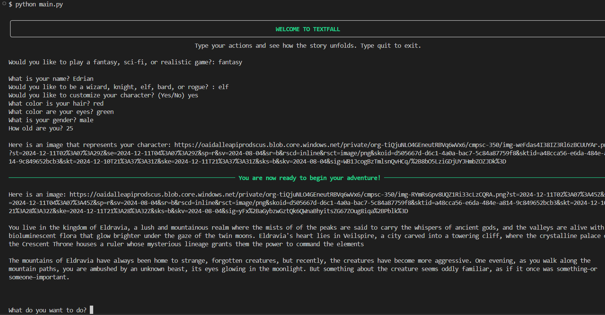
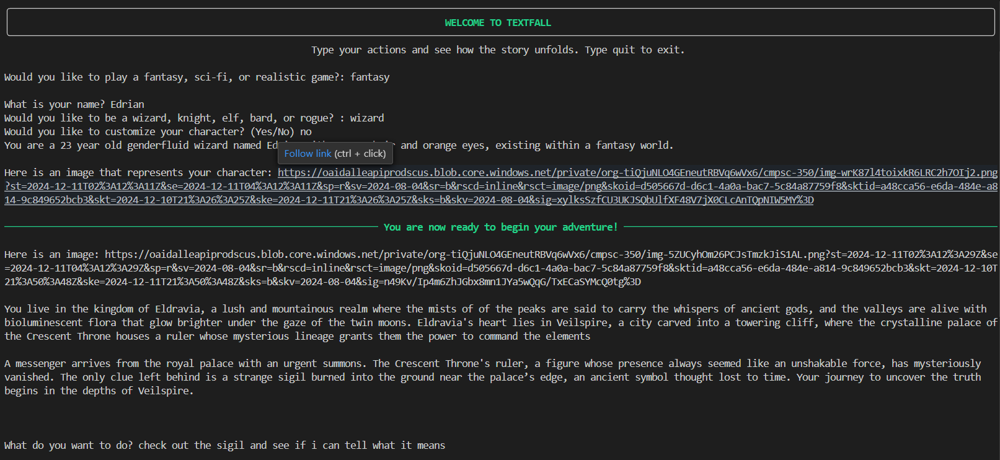
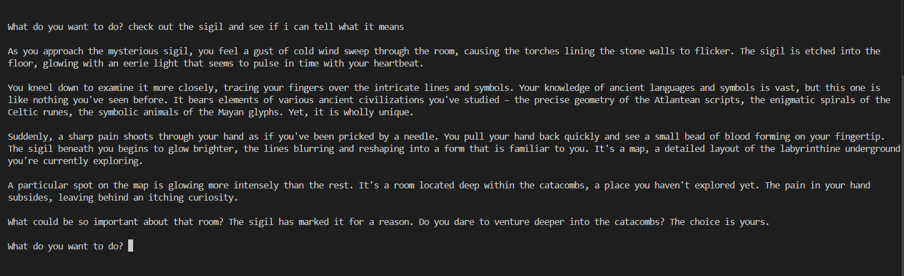

# CMPSC 350: Final Reflection

## Final title

Textfall

## Summary

Textfall is a text-based adventure RPG that utilizes generative AI to create unique experiences for each user.

## Reference works

TODO: Incorporate the three (3) reference works which can include the body of work we've read this 
semester with a meaningful discussion of how they relate to your final work. Here, use
passages from both _your_ work _and_ the selected work to make this comparison (or 
contrast!) clear.

My work was inspired by the work we did in class with Twine along with similar AI text RPG games such as [AI Dungeon](https://en.wikipedia.org/wiki/AI_Dungeon) and [Saga RPG](https://dang.ai/tool/ai-text-rpg-sagarpg). My game follows a similar concept as AI Dungeon in the sense that players are prompted to choose a genre setting for their adventure and uses AI to create new storylines based on user input. One of the ways that Textfall is different from AI Dungeon, however, is that there are no limits to what the user input can be. In AI Dungeon, there are four main interaction methods the user can choose from (Do, Say, Story, or See) whereas my game simply prompts the user with the question "What do you want to do?" Saga RPG is also quite similar to Textfall and AI Dungeon but it seems to focus a bit more on traditional aspects of games, such as inventory and battles. I chose for Textfall to essentially be whatever game the user allows it to be and give the user pretty much total control over where the story goes without the user having to actually write the story itself. I also created the ability to customize a character, which utilizes Dall-e to generate an illustration based on the character description. The paper [AI in Game: A study about understanding AI in game development](https://mlrobotics.wordpress.com/wp-content/uploads/2023/04/ml_paper_hui-cheuk-yin-lin-zhiwei.pdf) by Lin Zhiwei and Hui Cheuk Yin "provides insights into how AI can be utilized to create more engrossing and immersive game experiences" which is exactly what Textfall aims to do.

## Describe your single largest success.

I would probably say that my largest success was the fact that I created a functioning game, one will multiple starting options and the ability for users to customize their characters. I had never made a game of any sort before, so I would say I'm pretty successful for my first attempt.

### Example Output 1
This output shows how the user can customize their character

### Example Output 2
This output shows the general output from running the program, including user input

## Describe your single largest challenge or failure.

I would say that my largest challenge/failure would be not having an option for saving and coming back to the game or the fact that the images do not "open" in the terminal. I knew from the beginning that the images part would be an issue and unfortunately that is primarily due to the fact that this game is played within the terminal, so I am limited in what I can do/display. In terms of the actual coding, I had a lot of problems trying to create the ability to save the game and eventually decided that it was simply too much for me to try to figure out at this point in time, but it might be something that I come back if I continue this project outside of this class.

## The role of feedback

Talking with people about my project definitely helped me and made me think of some things I hadn't thought of before. For example, Aria wrote that "this is a game that could go on forever if the player just keeps on making choices" and therefore has no concrete ending. Although I did not choose to implement an ending because I wanted the user to have full control, this helped me think about other aspects of games that I could choose to include/not include. This was definitely helpful because, as I said before, I've never made a game so it was nice to get another opinion. Additionally, I tend to be very critical about my work which can sometimes make me feel defeated and give up on a project, so having Alish write that my project was "going to be fun!" was very nice to read.

## Contextualizing

I think that my work fits into my understanding of this course because it uses technology to create narrative (just like the course name) and I used my experiences with prompt engineering and different LLM APIs to help create my project.
I think that my work could also fit into a discussion about bias within AI and how this bias unintentionally affects outcomes. The reason I say this is because of the image generation for the character that the user creates. Although I do not specify any race or skin tone, the generated character is often white or has white/European features which I think showcases how POC can often unintetionally be excluded through the use of AI. I think it would be interesting to experiment on if this is something that I can change through prompt engineering or even see if different models for image generation behave differently.
I think my final take-away from participating in this course is that technology, specifically AI, can help us to create narrative works that are much harder for us to do manually and that the meaning of narrative/text can also be changed depending on how it is being created (like whether computationally or manually). I think that for me this factors into my work because it allows me to create a game that can essentially go on forever and have whatever storyline someone wants without me having to come up with all of the stories and writing. That being said, I think that this is a bit of a double edged sword and it is important to recognize that these outputs do not come from nothing and are instead using information taken from other people's already created work, which is something we talked about previously in class. I think that using AI in this way can potentially lead to creative work and intellectual preperty being stolen (even if unintentionally) or even lead to people's creativity diminishing because they are no longer coming up with things themselves. So I think that is something that is important to keep in mind and will certainly be a factor in the decisions that I make about this project long terms.